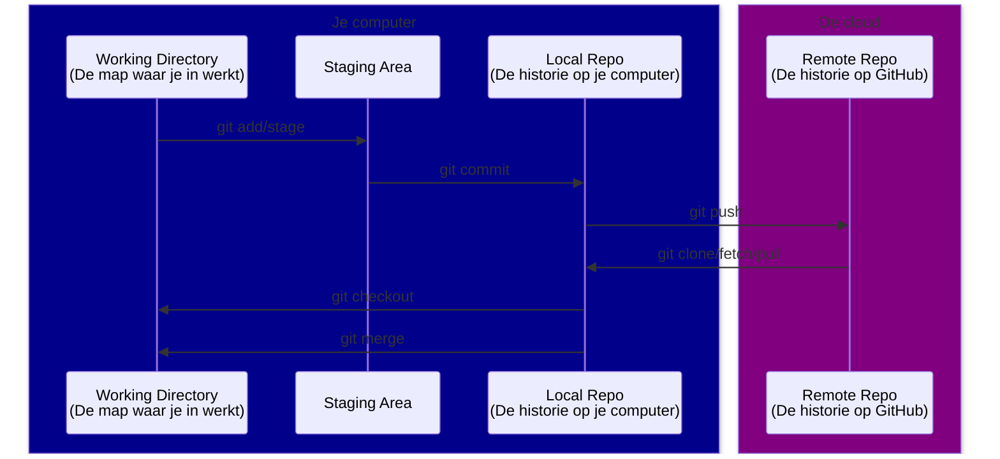

# Git concepten/operaties

```mermaid
sequenceDiagram
    participant WD as Working Directory<br>(De map waar je in werkt)
    participant SA as Staging Area
    participant LR as Local Repo<br>(De historie op je computer)
    participant RR as Remote Repo<br>(De historie op GitHub)

    WD ->> SA: git add/stage
    SA ->> LR: git commit
    LR ->> RR: git push
    RR ->> LR: git clone/fetch/pull
    LR ->> WD: git checkout
    LR ->> WD: git merge

box darkBlue Je computer
participant WD
participant SA
participant LR
end

box purple De cloud
participant RR
end
```

Vraag: Waar 'leeft' het eerdergenoemde _safety net_?
