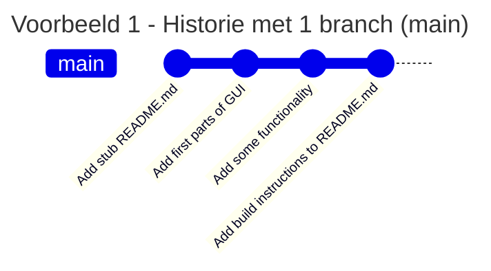
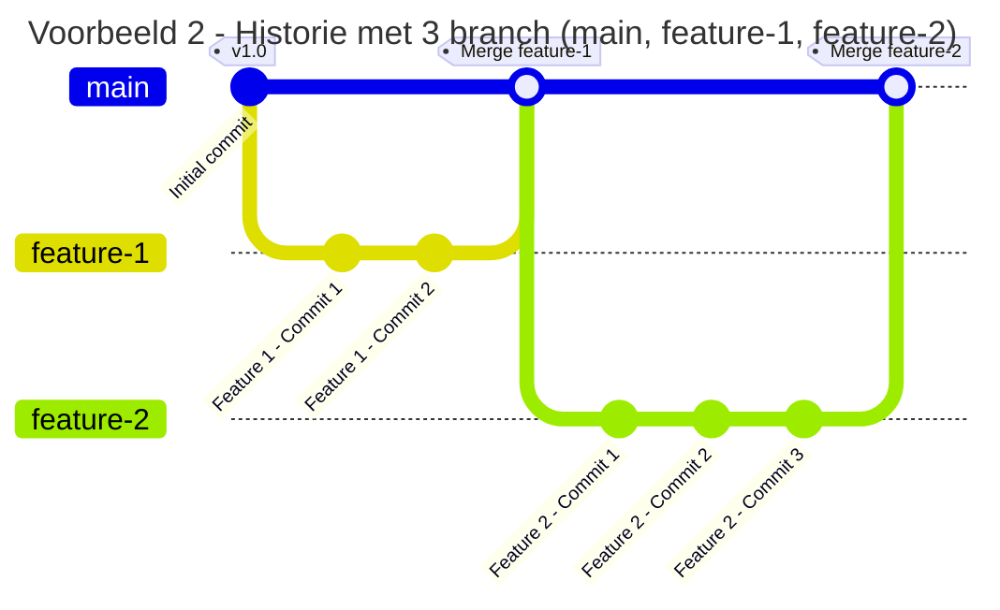

# Git branches

  <q>Branching means you diverge from the main line of development and continue to do work without messing with that main line.</q>
  1

<Footnotes separator>
  <Footnote :number=1>Bron: <a href="https://git-scm.com/book/en/v2/Git-Branching-Branches-in-a-Nutshell">git-scm.com</a></Footnote>
</Footnotes>

---
layout: two-cols
---

# Git branches

- Tot nu toe: lineare historie (vb. 1)
- Nieuwe situatie commit maken (vb. 2):
  1. Maak branch (aftakking) vanaf _main_
  2. Werk aan feature of bugfix
  3. Commit naar nieuwe branch
  4. Ga naar GitHub, maak een pull request:

::right::

---

# GitHub pull requests

---

# Merge conflicts
