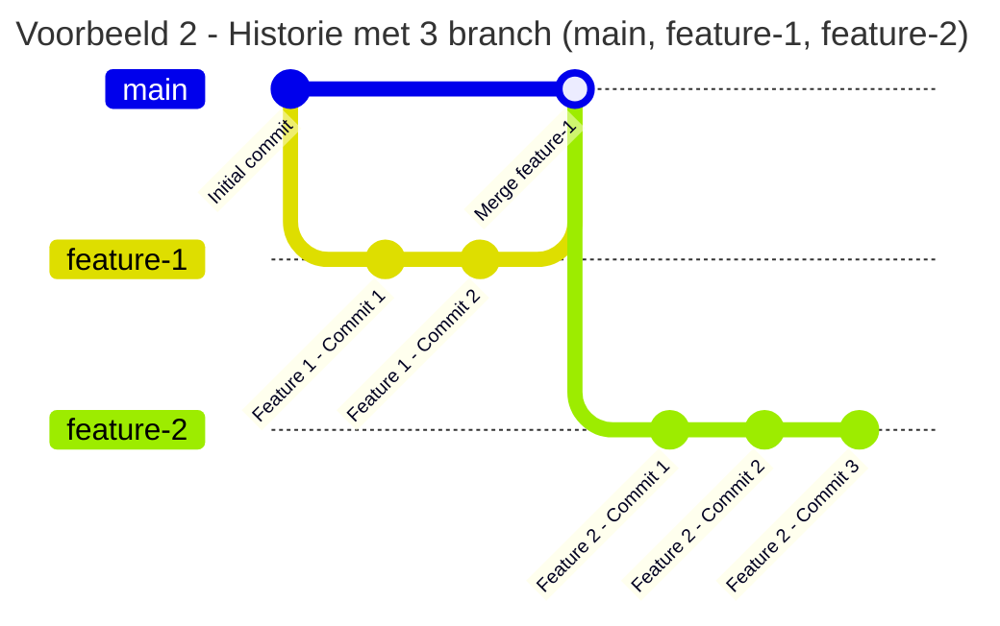
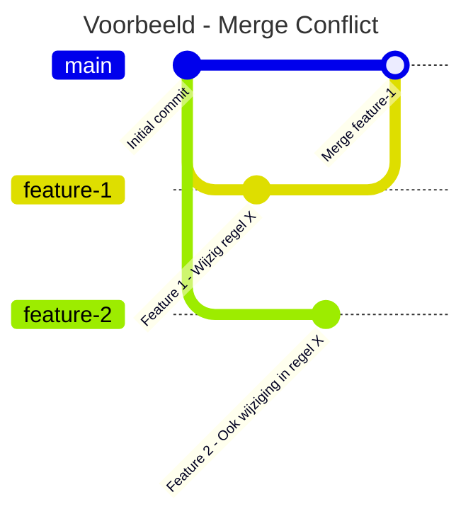

# Git branches

  <q>Branching means you diverge from the main line of development and continue to do work without messing with that main line.</q>
  1

<Footnotes separator>
  <Footnote :number=1>Bron: <a href="https://git-scm.com/book/en/v2/Git-Branching-Branches-in-a-Nutshell">git-scm.com</a></Footnote>
</Footnotes>

---
layout: two-cols
transition: fade
---

# Git branches

- Tot nu toe: lineare historie (vb. 1)
- Nieuwe situatie commit maken (vb. 2):
  - Verboden naar _main_ te committen, wat wel:
    1. Maak branch (aftakking) vanaf _main_
    2. Werk aan feature of bugfix
    3. Commit en push naar nieuwe branch
    4. Merge via pull request
    5. Rinse & repeat
- Pull request: Verzoek om een branch te mergen in een andere branch
  - Oftewel: De wijzigingen van een branch A bij een branch B te voegen
  - Voorbeeld: _feature-1_ naar _main_

::right::

---
transition: fade
---

# Git branches - VS Code

---
layout: figure
transition: fade
figureUrl: img/branches-and-prs/pull-requests.png
figureCaption: De pull requests pagina van GitHub.
---

# GitHub pull requests

---
layout: figure
transition: fade
figureUrl: img/branches-and-prs/create-pull-requests.png
figureCaption: Zorg voor een beschrijvende titel en omschrijving en maak de pull request.
---

# GitHub pull requests

---
layout: two-cols
transition: fade
---

# Merge conflicts

- Conflicterende wijzigingen uit 2 branches
- Komt o.a. door:
  - Zelfde line(s) gewijzigd
  - Branch 1: File verwijderd/hernoemd Branch 2: File gewijzigd

::right::

